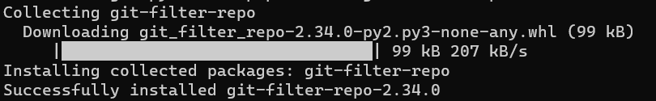
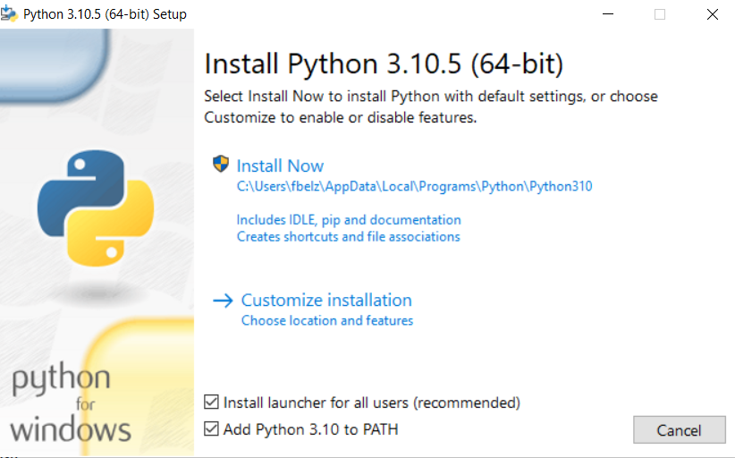

# Installationsanleitung für git-filter-repo

Diese Installationsanleitung wurde aus dem unten aufgeführten Guide zusammengesetzt, um speziell für Windows User die Installation von git-filter-repo zu beschreiben.

## Anleitung
Theoretisch ist die Installation ganz einfach, wenn Python installiert ist. Einfach eine Konsole deiner Wahl öffnen und folgenden Befehl ausführen:
```
$ python3 -m pip install git-filter-repo
```
oder
```
$ python -m pip install git-filter-repo
```
oder
```
$ py -m pip install git-filter-repo
```
(Je nach dem wie Python installiert wurde)

Danach wird der Installationsfortschritt in der Konsole angezeigt.


Wenn die Installation abgeschlossen wurde, zum Testen folgendes eigeben:
```
git filter-repo
```
Wenn ```No Arguments specified``` angezeigt wird, war die Installation erfolgreich, sonst erstmal Rechner neustarten.

## Python Installation
Neueste Python Version herunterladen:
https://www.python.org/downloads/

EXE-Datei die heruntergeladen wurde ausführen.

Im aufgetauchten Fenster den Haken bei "Add Python to PATH" setzen

Dann auf "Install Now" klicken und nach abgeschlossener Installation das Fenster schließen.

Beliebige Konsole öffenen und folgenden Befehl eingeben:
```
$ python3 --version
```
oder
```
$ python --version
```
oder
```
$ py --version
```
Dann sollte `Python 3.10.5` angezeigt werden, sonst erstmal die Konsole, dann den Rechner neustarten.

## Quellen
- https://github.com/newren/git-filter-repo/blob/main/INSTALL.md